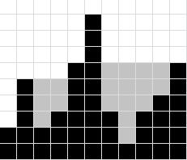

Игра PitCraft происходит в двумерном мире, который состоит из
блоков размером 1 на 1 метр. Остров игрока представляет собой набор столбцов разной высоты,
состоящих из блоков камня и окруженный морем. Над островом прошел сильный дождь,
который заполнил все низины, а не поместившаяся в них вода стекла в море, не увеличив
его уровень.
По ландшафту острова определите, сколько блоков воды осталось после дождя в низинах на острове.

